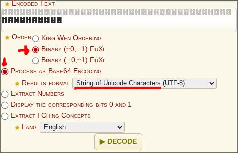

# 2ez4u

## Description
> If you know, you know.

Tags: _misc_

## Recon

I was given a [file](./yijing-hexagram) containing Yijing hexagram symbols. 

Yijing (I Ching) hexagrams are Chinese divination symbols consisting of six horizontal lines. These hexagrams are represented in Unicode as characters.

Each hexagram can represent different values depending on the encoding scheme 

## Exploitation

I used the [dCode hexagram decoder](https://www.dcode.fr/hexagram) to decode the Yijing symbols.

The key was configuring the decoder with the correct settings:

After decoding the sequence I obtained the flag.

## Flag

`KDCTF{h3x49R4M-1s-4Lw4yS-b3ST49r4m!}`
